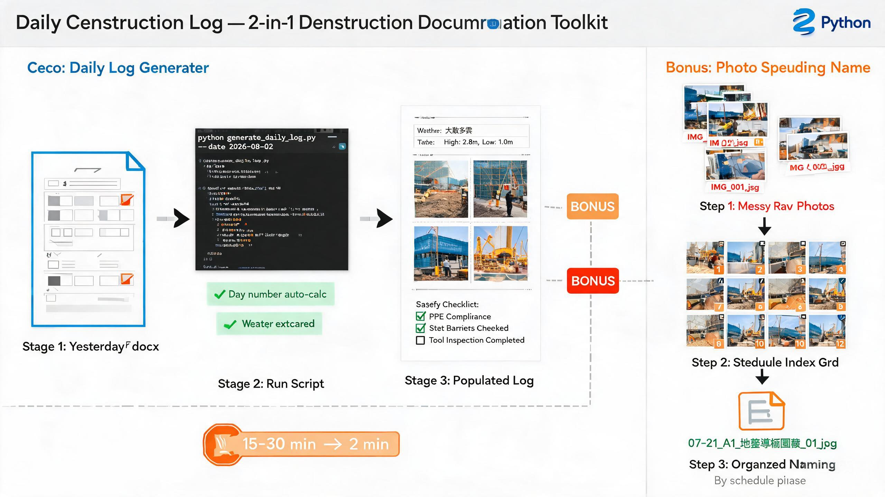

<div align="center">

# Daily Construction Log Generator

### Automated daily construction record generation for MEP projects — copy yesterday's docx, modify changing fields, embed photos, export PDF.

Built from real construction workflows. Automates the most repetitive documentation task on site: daily construction records with weather data, tide reports, site photos, and safety checklists — all generated from a single command.

[](https://opensource.org/licenses/MIT)
[](https://python.org)
[](https://python-docx.readthedocs.io)
[](https://pymupdf.readthedocs.io)
[](https://github.com/David-CB666/daily-construction-log/stargazers)
[](https://github.com/David-CB666/daily-construction-log/commits)

[Quick Start](#-quick-start) · [Features](#-features) · [Documentation](#-documentation) · [中文介绍](#-中文介绍)

</div>

---

## 📸 Demo



*2-in-1 toolkit: Daily log generator (core) + photo schedule naming (bonus)*

## 🎯 The Problem

Every construction project requires **daily construction records** — formatted Word documents with:
- Date and day number (from project start)
- Weather data (from meteorological bureau PDFs)
- Tide data (from tidal forecast PDFs, including image-based OCR)
- Construction progress and worker count
- Site photos (embedded in specific table cells)
- Safety self-inspection checklist (checkboxes)
- Warning tide level assessment (≥3m threshold)

Engineers typically spend **15-30 minutes per record** doing manual copy-paste, photo insertion, and PDF merging.

## 💡 The Solution

**Copy yesterday's docx → modify only changing fields → embed photos → export PDF with weather + tide reports merged.**

```
Yesterday's docx ──copy──→ Today's docx ──modify──→ Embed photos ──export──→ PDF + Weather + Tide = Final PDF
```

## 🚀 Quick Start

```bash
git clone https://github.com/David-CB666/daily-construction-log.git
cd daily-construction-log
pip install -r requirements.txt
```

### Generate a Daily Log (one command)

```bash
python scripts/generate_daily_log.py \
  --date 2026-08-02 \
  --workers 4 \
  --tasks "安裝圍網,安裝水電樁,堤岸燈安裝"
```

### With Manual Weather/Tide Override

```bash
python scripts/generate_daily_log.py \
  --date 2026-08-02 \
  --workers 4 \
  --tasks "工序1,工序2" \
  --weather "大致多雲" \
  --tide-low "1.0m（約17:00）" \
  --tide-high "2.8m（約08:00）" \
  --no-pdf
```

### Standalone PDF Merger

```bash
python scripts/merge_pdf.py --date 2026-08-02
```

Merges: construction record PDF + weather report PDF + tide forecast PDF → one complete file.

## ✨ Features

| Feature | Description |
|---------|-------------|
| 📋 **Copy-yesterday strategy** | Inherits all formatting, checkboxes, table structure from yesterday's docx |
| 🌤️ **SMG weather extraction** | Reads weather description from meteorological PDF (Chinese + Portuguese) |
| 🌊 **SMG tide extraction** | Renders tide forecast PDF to PNG for image-based OCR |
| 📸 **Auto photo embedding** | Scans photo directory, embeds 4 photos at 2.6"×2.0" in table cells |
| 📄 **PDF auto-merge** | docx→PDF + weather PDF + tide PDF → one complete record |
| 📅 **Day number auto-calc** | Yesterday's day + 1 (eliminates manual counting errors) |
| ⚠️ **Warning tide assessment** | High tide ≥3m → warning flag; <3m → no warning |
| ✅ **Safety checklist inheritance** | Preserves yesterday's checkbox states (never reset) |
| 🏷️ **Stage prefix preservation** | Construction stage prefixes (A/B/C/D...) inherited from yesterday |
| 🎨 **Format preservation** | All fonts, layouts, headers inherited — never rebuilt from scratch |

## 📁 Project Structure

```
daily-construction-log/
├── scripts/
│   ├── generate_daily_log.py    # One-click generator (copy + modify + embed + export)
│   └── merge_pdf.py             # Standalone PDF merger
├── docs/
│   ├── workflow-full.md         # Complete workflow manual (with lessons learned)
│   ├── photo-rules.md           # Photo processing rules
│   └── reference-screenshots.md # Troubleshooting case studies
├── templates/
│   └── 空白模板說明.md           # Blank template structure (for reference only)
├── artifacts/                   # Generated log examples
├── README.md
└── LICENSE
```

## 📐 Core Rules

### Photo Specifications

```python
PHOTO_WIDTH_INCH = 2.6   # Must not exceed — 4 photos must fit on one page
PHOTO_HEIGHT_INCH = 2.0
```

### Day Number Calculation

```python
# Project start date → Day 1
# Day number = (today - project_start_date) + 1
```

### Warning Tide Threshold

```
High tide ≥ 3.0m → ☑ 是 (Warning)
High tide < 3.0m → ☑ 否 (No warning)
```

### Template Strategy

```
✅ Copy yesterday's docx → modify changing fields only
❌ Never use blank template (causes checkbox loss, structure errors)
```

## 📊 Real-World Impact

> *"以前每日施工記錄表要手動 Copy-Paste、插照片、合併 PDF，搞 15-30 分鐘一份。而家一條 command 搞掂，天氣潮汐自動提取，照片自動嵌入，PDF 自動合併。"*
> — Mike, MEP Project Manager

| Metric | Before (Manual) | After (Generator) |
|--------|----------------|-----------------|
| Time per record | 15-30 min | **2 min** |
| Error rate | ~20% (manual copy) | **<2%** |
| Photo embedding | Manual insert + resize | **Auto-scan + embed** |
| Weather/tide data | Manual lookup + type | **Auto-extract from PDF** |
| PDF merging | Manual merge 3 files | **Auto-merge** |

## 📖 Documentation

| Document | Description |
|----------|-------------|
| [Workflow Manual](docs/workflow-full.md) | Complete step-by-step guide with lessons learned and troubleshooting |
| [Photo Rules](docs/photo-rules.md) | Photo specifications, naming conventions, and embedding logic |
| [Troubleshooting](docs/reference-screenshots.md) | Case studies of common pitfalls and fixes |

## 🔧 Requirements

| Dependency | Required For | Install |
|------------|------------|---------|
| `python-docx` | docx manipulation | `pip install python-docx` |
| `docx2pdf` | PDF export | `pip install docx2pdf` |
| `pypdf` | PDF merging | `pip install pypdf` |
| `PyMuPDF` | Weather/tide PDF extraction | `pip install pymupdf` |
| Microsoft Word | PDF export (via COM) | Windows only |

## 🇨🇳 中文介绍

每日施工记录表自动生成工具。基于真实工程实战，自动完成：

- **复制昨日文档** → 只修改变动字段（日期、天数、天气、潮汐、施工内容、照片）
- **天气数据提取** → 从气象局 PDF 自动提取中文天气描述
- **潮汐数据提取** → 渲染潮汐预报 PDF 为图片，辅助识别数值
- **照片自动嵌入** → 扫描照片目录，按 2.6"×2.0" 规格嵌入表格
- **PDF 自动合并** → 施工记录 + 天气报告 + 潮汐预报 → 一份完整 PDF
- **警戒潮位判断** → 高潮 ≥3m 自动标记警戒
- **安全自检继承** → 保持昨日 checkbox 状态不变

**核心策略：** 复制昨日 docx → 修改变动字段，而非从空白模板生成。这避免了 checkbox 丢失、表格结构错误、阶段编号前缀遗漏等问题。

## 🎁 Bonus Tool: Photo Schedule Naming

This repo also includes a site photo management tool as a bonus feature:

### Construction Photo Schedule Naming

Rename scattered site photos into structured filenames based on the construction schedule.

```
IMG_20250721_001.jpg → 07-21_A1_地盤準備圍蔽_01.jpg
```

**5-step workflow**: Read schedule → Scan photos → Generate contact sheets (visual ID) → Build mapping → Batch rename

| Script | Function |
|--------|----------|
| `bonus/references/generate_contact_sheets.py` | .heic conversion + visual contact sheet generation |
| `bonus/references/rename_photos_by_schedule.py` | Batch rename with `{date}_{phase_code}_{desc}_{seq}` format |

**Full documentation**: [bonus/BONUS.md](bonus/BONUS.md)

```bash
# Generate contact sheets for visual identification
python bonus/references/generate_contact_sheets.py

# Review sheets, edit MAPPING, then execute rename
python bonus/references/rename_photos_by_schedule.py
```

## 🔗 My Other Tools

| Tool | Description |
|------|-------------|
| [**GanttChart Pro**](https://github.com/David-CB666/gantt-chart-pro) | Professional Gantt charts in Excel — no MS Project |
| [**Excel Template Filler**](https://github.com/David-CB666/excel-template-filler) | Dual-engine batch template filling — images & print settings preserved |
| [**VBA Macro Reader**](https://github.com/David-CB666/VBA-Macro-Reader-v2.0.0) | Read, modify & execute VBA macros from .xlsm files |
| [**Material Submittal Generator**](https://github.com/David-CB666/material-submittal-generator) | One-click batch submittals + auto BQ page merging |

## 🤝 Contributing

Contributions are welcome! Please read the [Contributing Guide](CONTRIBUTING.md) before submitting a pull request.

## 📄 License

MIT © [David-CB666](https://github.com/David-CB666)

---

<div align="center">

### ⭐ If this tool saved you time, give it a star!

</div>
